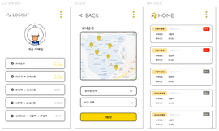

# 🚌 School Bus Reservation - 사용자용 앱

## 📱 프로젝트 소개
학생들이 직접 원하는 노선과 시간을 선택하여 버스를 예약할 수 있는 **스쿨버스 예약 앱**입니다.  
Firebase와 연동하여 예약 정보 관리 및 로그인 기능을 제공합니다.

> **관리자용 앱과 별도로 분리된 사용자 전용 버전입니다.**

---

## 🛠️ 사용 기술

- **Android Studio** (Java)
- **Firebase Authentication** - 사용자 로그인/회원가입 관리
- **Firebase Firestore** - 예약 정보 저장
- **Firebase Realtime Database** - (간단한 사용자 정보 관리)

---

## 🧩 주요 기능

- 🔑 **회원가입 / 로그인**: Firebase Authentication을 이용한 인증
- 🗺️ **노선 및 시간 선택**: 스피너를 통해 정해진 노선과 시간 선택
- 📝 **예약 등록**: 예약 정보를 Firestore에 저장
- 📜 **예약 목록 조회**: 사용자가 자신의 예약 내역을 확인 가능
- ❌ **예약 취소**: 출발 전까지 예약 취소 가능
- ⏰ **현재 시간 기준으로 지난 시간은 비활성화**
- 📋 **팝업 메뉴 제공**: 버스 정보 확인, 예약 리스트 보기, 로그아웃 기능

---

## 📂 프로젝트 구조

/userr_bus ├── MainActivity.java # 시작 스플래시 화면 (5초 후 login 이동) ├── login.java # 로그인 화면 ├── RegisterActivity.java # 회원가입 화면 ├── routechoose.java # 노선 선택 화면 ├── gyonea.java # 교내순환 노선 예약 ├── hayang.java # 하양역 출발 노선 예약 ├── ansimstation.java # 안심역 출발 노선 예약 ├── sawel.java # 사월역 출발 노선 예약 ├── ansim_sawel.java # 학교 출발 (A2 → 안심 → 사월) 예약 ├── selectbuslist.java # 예약 내역 조회 화면 ├── CustomAdapter.java # 예약 내역 리스트 어댑터 ├── Reservation.java # 예약 데이터 모델 ├── DecorationItem.java # RecyclerView 아이템 간격 설정 ├── popup_menu.xml # 팝업 메뉴 리소스

---

## ✨ 기타 특징

- ✅ 예약 시간은 현재 시간을 기준으로 선택 가능한 시간만 표시
- ✅ 예약 후 Firestore에 실시간 반영
- ✅ 사용자는 예약한 버스 정보만 조회/취소 가능
- ✅ 깔끔한 레이아웃과 간편한 조작

---

## 🔗 관련 링크

- [관리자용 앱 (driverr_bus)](링크 추가 예정)
- [Firebase 공식 문서](https://firebase.google.com/docs)

---

## 📱 스크린샷

### 🎓 사용자 앱 (User App)

---
